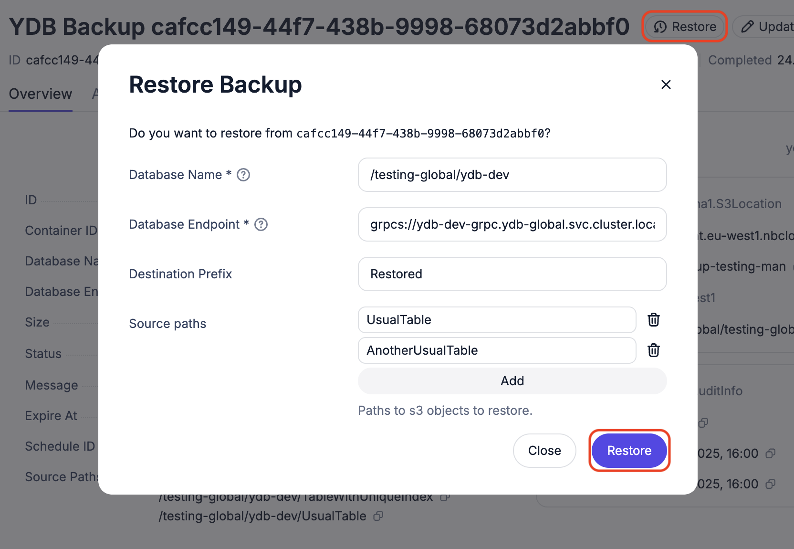
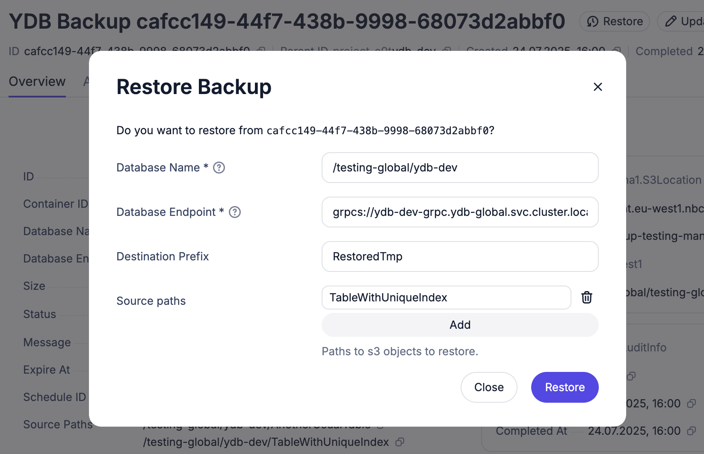

## Restoring databases with tables that have a unique index



If your database does not contain tables with unique indexes, you need to use the [regular procedure](#restore-backup).



In YDB version `24.4.*`, restoring tables with unique indexes is not supported — the import operation will fail. This will be fixed in future YDB versions. For now, follow the manual steps below to restore a backup with such tables.

Suppose your database and backup contain three tables: `UsualTable`, `AnotherUsualTable`, and `TableWithUniqueIndex`. The `TableWithUniqueIndex` table has a unique index and needs special handling.

The full list of tables in the backup can be obtained from UI info page from `Source paths` field.

1. Restore all tables except those with unique indexes using the regular procedure. Click the `Restore` button, enter the destination prefix, and add all normal tables as source paths (relative to database root). Then, click `Restore` in the dialog box.

    

    The next steps are for tables with unique indexes.

2. Restore each table with a unique index separately to a temporary path. If you have more than one table with unique index, process them **one at a time**.

    

3. Wait for the restore process to finish. It will end with an error: `Failed item check: unsupported index type to build`. To check if the process is finished, run this `YDB CLI` command (use the endpoint and database from the backup info in the UI):

    ```bash
    ydb -e <endpoint> -d <database> operation list import/s3
    ```

    Look for `ready=true` and the error message in the result.

4. In the YDB UI, open your database. Create the destination table with the correct schema and unique index using SQL. For example:

    ```sql
    -- docs: https://ydb.tech/en/docs/yql/reference/syntax/create_table
    CREATE TABLE `Restored/TableWithUniqueIndex` (
        TableKey Uint64,
        IndexKey String,
        -- Secondary indexes docs https://ydb.tech/en/docs/yql/reference/syntax/create_table#secondary_index
        INDEX uniq_idx_name GLOBAL UNIQUE SYNC ON (IndexKey),
        PRIMARY KEY (TableKey)
    );
    ```

5. Copy the imported data from the temporary table to the destination table using SQL (choose "YQL Script" query type in the UI). For example:

    ```sql
    UPSERT INTO `Restored/TableWithUniqueIndex` (TableKey, IndexKey)
    SELECT TableKey, IndexKey FROM `RestoredTmp/TableWithUniqueIndex`;
    ```

    If the table is large, you might get an error about the maximum data size for a query. In that case, insert the data in smaller portions, for example:

    ```sql
    UPSERT INTO `Restored/TableWithUniqueIndex` (TableKey, IndexKey)
    SELECT TableKey, IndexKey FROM `RestoredTmp/TableWithUniqueIndex` WHERE TableKey >= 100000 AND TableKey < 200000;
    ```

6. Check that the index works:

    ```sql
    SELECT * FROM `Restored/TableWithUniqueIndex` VIEW uniq_idx_name WHERE IndexKey = 'some_value';
    ```

7. Delete the temporary table:

    ```sql
    DROP TABLE `RestoredTmp/TableWithUniqueIndex`;
    ```

8. Repeat steps 2–7 for each table with a unique index.